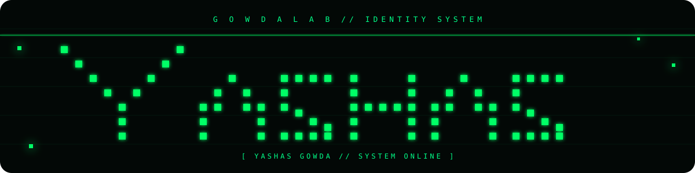

<div align="center">



<br>


</div>

---

# 🧪 GOWDA LAB

> **A personal technology lab where I build, break, test, experiment and learn.**

GOWDA LAB is my collection of projects, experiments, ideas and technical work across:

**Software Development · Cybersecurity · Artificial Intelligence · Web Development · UI/UX · Digital Marketing · Content Creation**

---

## `whoami`

```text
┌──────────────────────────────────────────────────────────────┐
│                         WHOAMI                               │
├──────────────────────────────────────────────────────────────┤
│ Name        : Yashas Gowda                                  │
│ Role        : Developer / AI Builder / Security Enthusiast   │
│ Education   : BCA Student @ PES University                  │
│ Lab         : GOWDA LAB                                     │
│ Focus       : Development • Cybersecurity • AI              │
│ Creative    : Design • Content • Digital Marketing          │
│ Philosophy  : Build → Test → Break → Understand → Secure   │
└──────────────────────────────────────────────────────────────┘
