<div align="center">



<br>

<a href="https://git.io/typing-svg">

</a>

<br>


<br><br>


<br><br>


</div>

---

<div align="center">


</div>

<table>
<tr>
<td width="55%" valign="top">

### `YASHAS GOWDA`


<br>

I'm a **BCA student and developer** interested in building useful digital products across **web development, cybersecurity, artificial intelligence and creative technology**.

I enjoy taking an idea from:

`IDEA → DESIGN → CODE → TEST → BREAK → FIX → SHIP`

<br>

**Current focus**

- Full-Stack Web Development
- Cybersecurity & Security Tools
- Artificial Intelligence
- Python & Programming
- Creative Digital Projects
- Content Creation

</td>

<td width="45%" valign="top">

```text
┌───────────────────────────────┐
│       GOWDA LAB // CORE       │
├───────────────────────────────┤
│                               │
│  OPERATOR     : YASHAS        │
│  ROLE         : DEVELOPER     │
│  DOMAIN       : TECH          │
│                               │
│  MODE         : BUILD         │
│  SECURITY     : ACTIVE        │
│  AI           : EXPLORING     │
│  STATUS       : ONLINE        │
│                               │
│  cursor.exe   : RUNNING █     │
│                               │
└───────────────────────────────┘
```


</td>
</tr>
</table>

---

<div align="center">


</div>

<table>
<tr>

<td width="50%" valign="top">

### 🛡️ SecureScan AI

**Cybersecurity + AI**

Security-focused toolkit for analysing URLs, files, hashes, JWTs, SSL and common web-security risks.

`SECURITY` `AI` `WEB`

</td>

<td width="50%" valign="top">

### 📓 Inkwell Diary

**Full-Stack Web**

A modern digital diary application with authentication, cloud data and a polished user experience.

`REACT` `SUPABASE` `WEB`

</td>

</tr>

<tr>

<td width="50%" valign="top">

### 🧬 CyberShield

**Cybersecurity**

A security-focused project exploring practical cybersecurity workflows and defensive tooling.

`SECURITY` `AI` `TOOLS`

</td>

<td width="50%" valign="top">

### 🤖 AI Experiments

**Artificial Intelligence**

A collection of experiments exploring AI-powered applications, automation and intelligent interfaces.

`PYTHON` `AI` `EXPERIMENTS`

</td>

</tr>
</table>

<div align="center">


</div>

---

<div align="center">


</div>

<div align="center">

### `PROGRAMMING`


<br><br>

### `DEVELOPMENT`


<br><br>

### `CYBERSECURITY + AI`


<br><br>

### `PRODUCTIVITY`


<br><br>

### `CREATIVE`


<br><br>


</div>

---

<div align="center">


</div>

```text
┌──────────────────────────────────────────────────────────────┐
│                    GOWDA SECURITY ENGINE                     │
├──────────────────────────────────────────────────────────────┤
│                                                              │
│  URL ANALYSIS       ████████████████████  ACTIVE             │
│  HASH ANALYSIS      ██████████████████░░  ACTIVE             │
│  JWT INSPECTION     █████████████████░░░  ACTIVE             │
│  SSL ANALYSIS       ████████████████░░░░  ACTIVE             │
│  FILE ANALYSIS      ███████████████░░░░░  ACTIVE             │
│  WEB SECURITY       ███████████████████░  ACTIVE             │
│                                                              │
│  SECURITY MODE      >>> MONITORING                           │
│  THREAT ENGINE      >>> READY                                │
│  SYSTEM STATUS      >>> ONLINE                               │
│                                                              │
└──────────────────────────────────────────────────────────────┘
```

<div align="center">


</div>

---

<div align="center">


<br><br>


<br><br>


</div>

---

<div align="center">


<br><br>


<br><br>


<br><br>


</div>

---

<div align="center">


<br><br>

<a href="https://github.com/yashas621">

</a>

&nbsp;&nbsp;&nbsp;&nbsp;&nbsp;&nbsp;

<a href="https://www.linkedin.com/in/yashas-gowda-k-aa737031b/">

</a>

<br><br>


</div>

---

<div align="center">


<br>


<br><br>

```text
┌─────────────────────────────────────────────────────┐
│                                                     │
│   GOWDA LAB // TERMINAL                             │
│                                                     │
│   > session terminated                              │
│   > connection preserved                            │
│   > next build loading... █                         │
│                                                     │
└─────────────────────────────────────────────────────┘
```

</div>
